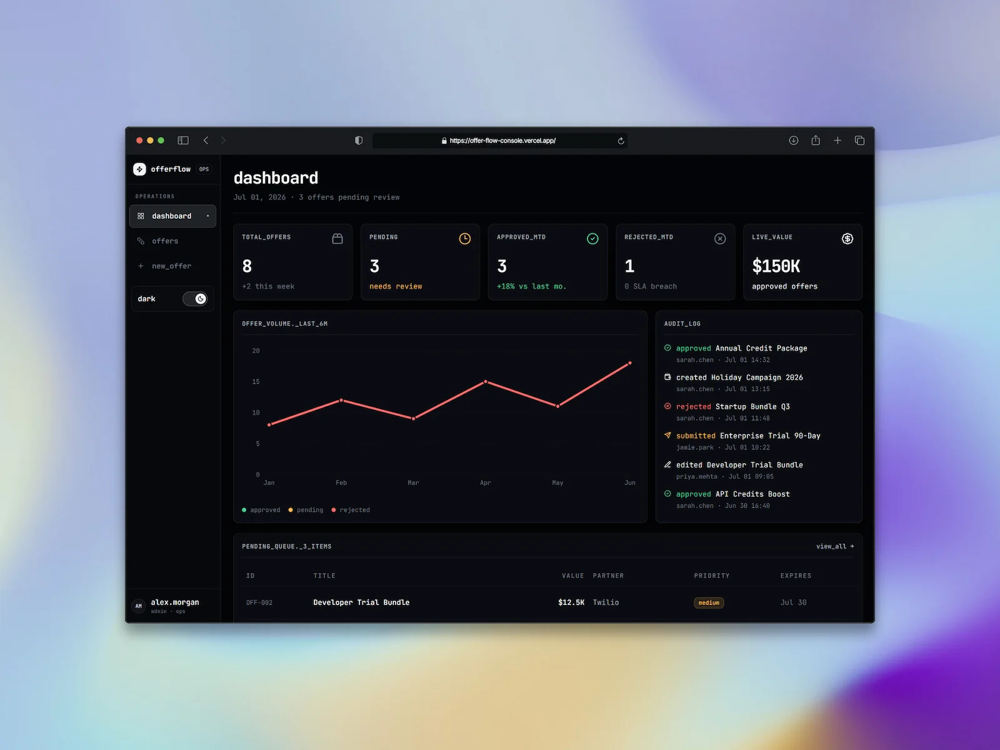

# OfferFlow



A focused interview-prep project demonstrating full-stack architecture for an operations dashboard for partner offers. Operators can browse, filter, create, edit, approve, reject, and prepare offers for publishing through a typed API backed by PostgreSQL in production.

The project intentionally stays small. Each feature demonstrates a specific ownership boundary in a modern React and Next.js application rather than simulating a production commerce platform.

# Live link
https://offer-flow-console.vercel.app/

## Stack

- Next.js App Router and React
- TypeScript in strict mode
- Tailwind CSS
- `next-themes` for system-aware light and dark mode
- The locally packaged Geist variable font (no runtime or build-time font CDN)
- TanStack Query for server state and mutations
- Zustand for shared client-only UI state
- Formik for form state
- Zod for runtime boundary validation
- Axios for the typed API client
- CVA and `clsx` for component class composition
- Next.js Route Handlers as the API boundary
- PostgreSQL and Postgres.js for durable production data

## Features

- Responsive dashboard shell with API-derived summary metrics
- Light and dark theme toggle with system-theme default
- Offers table with loading, error, and empty states
- Shareable title/partner, status, and category filters
- Server-side filtering with cursor pagination and bounded pages
- Comfortable and compact table density
- Offer detail pages with cached server state
- Create and edit forms with visible validation
- Date and time range picker with theme-aware calendar states
- Explicit approve and reject mutations
- Query cache updates and invalidation after mutations
- Typed DTO, UI model, form value, and API payload boundaries
- Guarded edits with optimistic concurrency and explicit conflict recovery
- Bounded JSON requests, field limits, shared mutation throttling, and application-level recovery pages

## Routes

| Route                        | Purpose                          |
| ---------------------------- | -------------------------------- |
| `/dashboard`                 | Live operations overview         |
| `/dashboard/deals`           | Offers table and URL filters     |
| `/dashboard/deals/new`       | Create offer form                |
| `/dashboard/deals/[id]`      | Offer details and review actions |
| `/dashboard/deals/[id]/edit` | Edit offer form                  |
| `/api/deals`                 | List and create offers           |
| `/api/deals/[id]`            | Read and update one offer        |
| `/api/deals/[id]/approve`    | Approve one offer                |
| `/api/deals/[id]/reject`     | Reject one offer                 |
| `/api/dashboard`             | Dashboard aggregates and queues |

## State ownership

State is assigned according to its lifecycle and sharing requirements:

- **Server data: TanStack Query.** Offer lists, detail records, request status, caching, mutations, and invalidation stay in the query layer. API records are never copied into Zustand.
- **Shared UI state: Zustand.** Table density is client-only presentation state shared by the density control and table. Components subscribe with selectors to avoid receiving unrelated state.
- **Shareable filters: URL search params.** Search, status, and category filters survive reloads, support browser history, and can be shared as links. The API applies them before returning a bounded cursor page.
- **Form state: Formik.** Create and edit values, touched fields, submission state, and field errors belong to each form instance.
- **Validation: Zod.** API responses, API payloads, and form values are checked at their boundaries.
- **API boundary: Axios client + Zod + DTO mapping.** Axios performs transport, Zod verifies runtime data, and mappers convert external DTOs into render-ready UI models.
- **Local component state:** Used only where a value is private to one component and does not need another ownership mechanism.

## Data shapes

The code deliberately avoids using one type everywhere:

- `DealDto` represents the backend response shape used by the typed offer API.
- `Deal` and `DealDetail` contain formatted, render-ready values.
- `DealFormValues` and `DealCreateFormValues` contain browser-friendly strings such as decimal prices and `datetime-local` values.
- `CreateDealPayload` and `UpdateDealPayload` contain API-ready integer cents and ISO timestamps.

Mappers in `src/lib/mappers/deal.ts` perform price and date conversions explicitly.

## API and data flow

A typical detail request follows this path:

1. A client component calls a typed function in `src/lib/api/deals.ts`.
2. Axios requests a Next.js Route Handler under `/api/deals`.
3. The route calls the repository boundary, which uses PostgreSQL in production and can use an in-memory adapter during local development and unit tests.
4. The client validates the response with Zod.
5. A mapper converts the DTO into a UI model.
6. TanStack Query caches the server record using keys such as `['deal', dealId]`.

Mutations enforce a 32 KiB JSON request limit, validate bounded payloads on the server, apply shared per-client and global rate limits, update the durable repository, seed or refresh the detail cache, and invalidate the offers list and dashboard deliberately. Metadata edits include the last-seen update timestamp so newer review decisions cannot be overwritten silently.

The mutation limiter uses a SHA-256 digest of the first address supplied by `X-Forwarded-For`, falling back to `X-Real-IP`. Production deployments must sit behind a trusted reverse proxy that overwrites these headers; otherwise clients can spoof their rate-limit identity. A global limit remains in place as a second guard.

Offer schedules use UTC from input through storage and presentation. The UI labels that policy directly rather than interpreting timezone-free form values as local time.

## Architecture notes

- Server Components provide route layouts and page structure. Client Components are introduced only for browser APIs, forms, queries, mutations, and Zustand subscriptions.
- Query keys are centralized in `src/lib/query-keys.ts`.
- Shared types live under `src/types`.
- Styling variants use CVA; ordinary class composition uses `clsx`.
- TSX templates avoid ternary expressions in favor of named helpers or explicit conditional rendering.
- Invalid URL filter values are ignored safely while unrelated query parameters are preserved.

## Project structure

```text
src/
  app/
    api/                 Backend route handlers
    dashboard/           Dashboard, list, detail, create, and edit routes
  components/
    dashboard/           Dashboard shell and reusable overview components
    deals/               List, filters, forms, detail UI, and mutations
    providers/           TanStack Query and theme providers
    theme/               Theme toggle controls
  lib/
    api/                 Axios client and typed request functions
    mappers/             DTO, UI, form, and payload conversions
    schemas/             Zod schemas
    server/              Repository facade, PostgreSQL adapter, and throttling
    validation/          Formik-compatible validation adapters
  mocks/                 Mock records, partners, and in-memory repository
  stores/                Zustand UI store
  types/                 Dedicated domain and UI types
db/
  migrations/            Idempotent PostgreSQL schema
  seed.sql               Development seed records
scripts/
  run-database-sql.mjs   Migration and seed runner
```

## Running locally

Requirements: a current Node.js LTS release and npm.

```bash
npm install
npm run dev
```

Open [http://localhost:3000/dashboard](http://localhost:3000/dashboard).

Without `DATABASE_URL`, development and tests use the non-durable in-memory adapter. To exercise the production data path, copy `.env.example` to `.env.local`, set a PostgreSQL connection string, then run:

```bash
npm run db:migrate
npm run db:seed
npm run dev
```

Production intentionally has no in-memory fallback: `DATABASE_URL` and an applied migration are required before starting the app. The committed seed is optional outside development.

Quality checks:

```bash
npm run test
npm run lint
npm run typecheck
npm run build
```

The same lint, type-check, test, and production-build gates run in GitHub Actions for pushes to `main` and pull requests.

## Current limitations

- Authentication and authorization are intentionally out of scope for this public pet project. Anyone who can reach the app can view and mutate offers.
- Partner choices remain a fixed application-owned catalog rather than a managed database entity.
- The in-memory repository is for local development and unit tests only; its changes reset when that process restarts.
- Automated coverage includes filtering and pagination, dashboard-derived data, request limits and throttling, malformed API JSON, guarded updates, durable cross-instance repository behavior, form accessibility semantics, and search navigation behavior.
- Accessibility is considered in semantic structure and focus states, but it has not undergone a full assistive-technology audit.

This repository is an architecture exercise rather than a production commerce system.

## Next steps

The next testing milestone should add browser-level coverage around complete create, edit, and decision flows. A future product iteration could add managed partners and an append-only workflow audit log.
